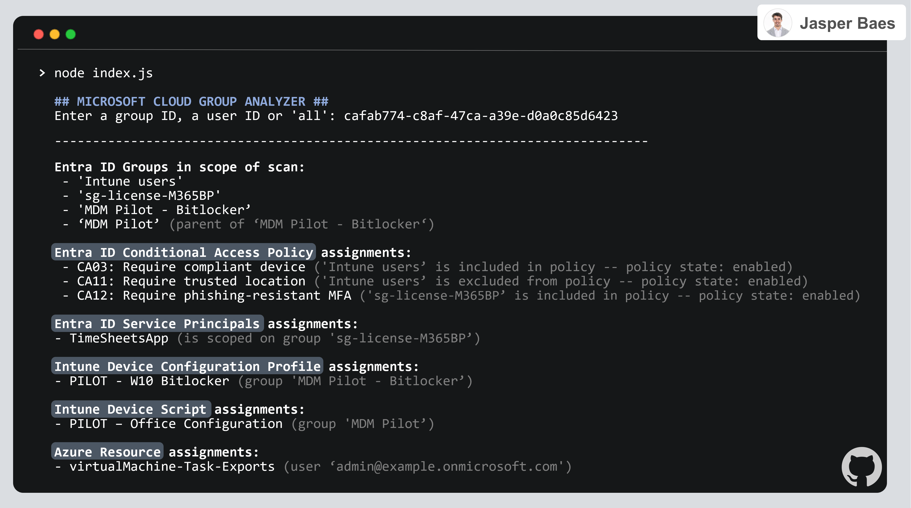
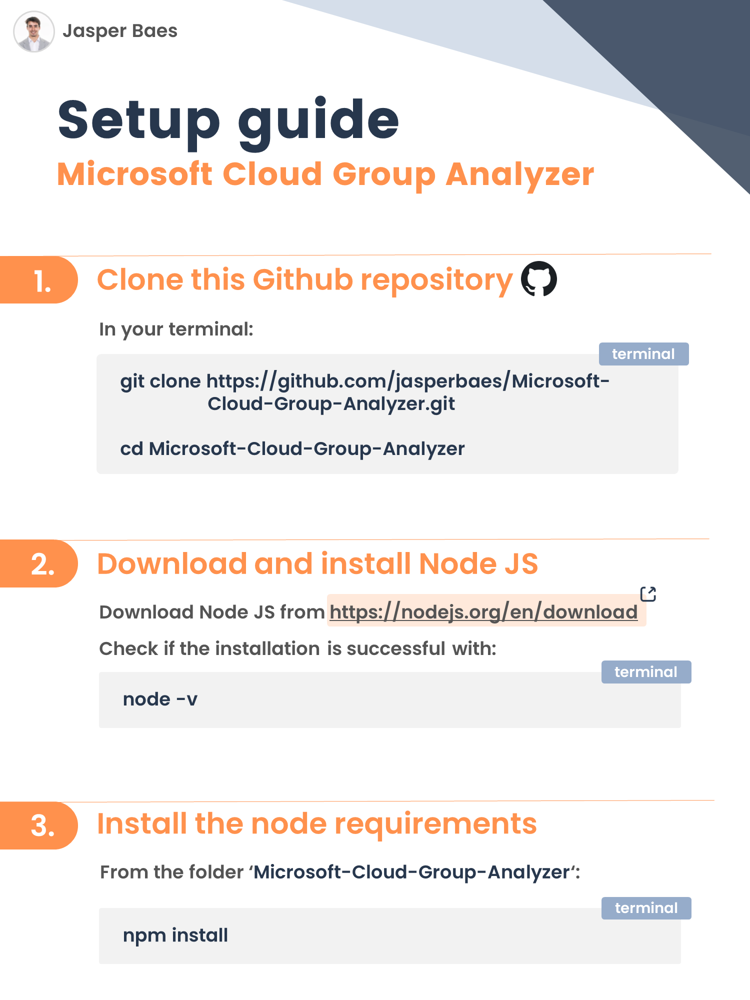
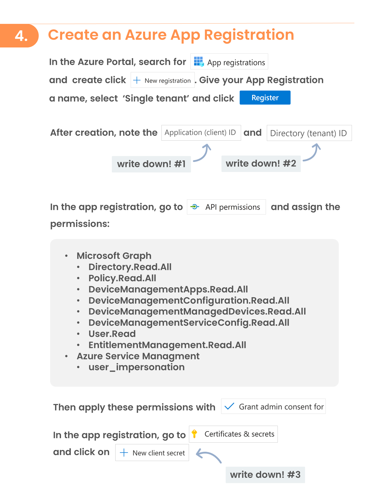
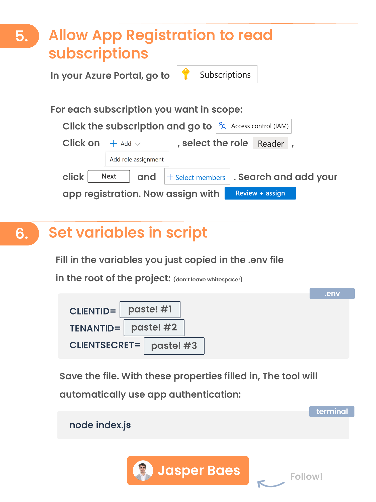

<br>
<p align="center">
  <a href="https://www.linkedin.com/in/jasper-baes/">
    
  </a>
  <h3 align="center">Microsoft Cloud Group Analyzer</h3>
  <p align="center">
    Track where Entra ID Groups are used! 💪
    <br />
    <a href="https://github.com/jasperbaes/Microsoft-Cloud-Group-Analyzer#installation-and-usage">View setup guide </a>
    ·
    <a href="https://github.com/jasperbaes/Microsoft-Cloud-Group-Analyzer/fork"> Fork this project</a>
    ·
    <a href="https://github.com/jasperbaes/Microsoft-Cloud-Group-Analyzer/issues"> Report Bug </a>
    ·
    <a href="https://github.com/jasperbaes/Microsoft-Cloud-Group-Analyzer/issues"> Request Feature </a>
  </p>
</p>
<br />


Entra ID Groups are often used in multiple locations in your environment and used by multiple admins. Without continuously updating documentation or syncing with other admins, you’re all using groups blindly, potentially causing unintended security or user impact through changes in group memberships. Therefore, I've created this script.

For **Microsoft Cloud admins** who **struggle to keep track of where Entra ID groups are used**, Group Analyzer is an **opensource script** that provides **instant insights in what services/policies/... a given group or user is scoped to**.

<a href="./assets/mcga.png" target="_blank"></a>

Group Analyzer is an essential script for Microsoft Cloud Administrators seeking comprehensive visibility into the usage of Entra ID groups across their environment. By providing detailed insights, this tool empowers admins to:

- **Prevent Unintended Impacts:** Safeguard against inadvertent membership modifications in groups that could trigger unexpected configuration changes in various services.
- **Enhance Group Management:** Maintain a clear overview of group assignments, ensuring efficient and informed management of your cloud environment.
- **Save time:** Don't spend time going over all of your policies and services looking where a certain Entra ID group is used.
- **Feel in control:** To be certain and have confirmation that you are not adding users to groups, causing unforseen impact.

Find the original post on [LinkedIn](https://www.linkedin.com/feed/update/urn:li:activity:7157748584753319936/).

## What's in scope?

Group Analyzer lists group memberships for following services:

| Available |                     Service                      |                                                                     Description / Comment / Reason |
| --------- | :----------------------------------------------: | -------------------------------------------------------------------------------------------------: |
| ✅         |            Entra ID Group memberships            |                                                                                                    |
| ✅         |                  Entra ID Roles                  |                                                                                                    |
| ✅         |         Entra ID Enterprise Applications         |                                                                                                    |
| ✅         |            Entra ID MFA Registration             |                                                                                                    |
| ✅         |         Entra ID Authentication Methods          |                                                                                                    |
| ✅         |       Entra ID Conditional Access Policies       |                                                                                                    |
| ✅         |   Intune Enrollment Devices Limit restrictions   |                                                                                                    |
| ✅         |     Intune Enrollment Device OS restrictions     |                                                                                                    |
| ✅         |            Intune Compliance Policies            |                                                                                                    |
| ✅         |          Intune Configuration Profiles           |                                                                                                    |
| ✅         |              Intune Device Scripts               |                                                                                                    |
| ✅         |          Intune App Protection Policies          |                                                                                                    |
| ✅         |        Intune App Configuration Policies         |                                                                                                    |
| ✅         |       Intune Autopilot Deployment Profiles       |                                                                                                    |
| ✅         |               Microsoft 365 Teams                |                                                                                                    |
| ✅         |                 Azure Resources                  | If the input is a User ID, the resources where that specific user is assigned to are also reported |
| ✅         |               Azure Subscriptions                |                                                                                                    |
| ✅         |                  Access Package                  |                                                                                         |
| ❌         | Entra ID Authentication Methods feature settings |                                                 Coming soon (Only for Microsoft Authenticator app) |
| ❌         |           Entra ID Administrative Unit           |                                                                                        Coming soon |
| ❌         |              Entra ID Cross Tenant               |                                                                                        Coming soon |
| ❌         |                 Attack Simulator                 |                                                   Microsot Graph does not provide the target scope |
| ❌         |            Entra ID App Registrations            |                              Entra ID App Registrations can only be scoped on users, not on groups |


## Installation and usage

<a href="./assets/mcga-1.png" target="_blank"></a> <br>
<a href="./assets/mcga-2.png" target="_blank"></a> <br>
<a href="./assets/mcga-3.png" target="_blank"></a> <br>


```sh
git clone https://github.com/jasperbaes/Microsoft-Cloud-Group-Analyzer.git
cd ./Microsoft-Cloud-Group-Analyzer
npm install
```

Create the file '.env' in the root of the folder and fill in below fields (guide above):

```
CLIENTSECRET=<app secret>
TENANTID=<your tenant ID>
CLIENTID=<app registration ID>
```

## Usage

Examples:

```sh
node index.js
node index.js xxxx-xxxx-xxxx-xxxx
node index.js xxxx-xxxx-xxxx-xxxx --export-json
node index.js xxxx-xxxx-xxxx-xxxx --export-csv
node index.js xxxx-xxxx-xxxx-xxxx --export-json --export-csv
node index.js all --export-json --export-csv
node index.js all -f Cloud-Analyzer-export.json
node index.js xxxx-xxxx-xxxx-xxxx --cli-only
```

| Parameter           |               Description |
| ----------------- | --------------------------------------------------------------: |
| `xxxx-xxxx-xxxx-xxxx` | The group ID / user ID or 'all' should be the first parameter. This parameter is optional.  |
| `--export-json` | This parameter will export the results to JSON in a file in the current directory. This parameter is optional and can be used with any other parameter. |
| `--export-csv` | This parameter will export the results to JSON in a file in the current directory. This parameter is optional  and can be used with any other parameter. |
| `-f` | This parameter specifies an import JSON file. Format needs to be the same as the JSON exported with the parameter --export-json. This parameter is optional  and can be used with any other parameter. |
| `--cli-only` | With this parameter, the web report will not be generated or opened. This parameter is optional  and can be used with any other parameter. |

Without specifying an ID in the command, the script will ask you to paste a group ID, a user ID or the word 'all':

| Option            |               example                |                                                     Description |
| ----------------- | :----------------------------------: | --------------------------------------------------------------: |
| Entra ID Group ID | `99ccbd7e-0fc9-4545-8cf9-ee89191ed78d` |                       The given group will be taken in scope ID |
| Entra ID User ID  | `caf7b774-c8ab-47c3-a39e-d0a0d85d6423` | All groups where the given user is member of are taken in scope |
| 'all'             |                 `all`                  |              This option will take all Entra ID groups in scope |

## Web report

An automated visual web report will be generated and opened in your default browser. To skip the web report and use the command line interface only, include the `--cli-only` parameter. To save it as a PDF, use the shortcut Ctrl + P.

## Issues?

I cannot rule out the existence of current or future issues with this open-source project. These may be related to hard-coded elements or the Microsoft 365 API used. If there are any issues, please feel free to report them. I will see what I can do to resolve them.

## Contact

Jasper Baes (https://www.linkedin.com/in/jasper-baes)

## Release history

Release version numbers: YEAR-WEEK-REV

- 2024.05
  - temporary removed documentation for user login. App authentication recommended for now.
  - improved error reporting
  - improved documentation and setup guide
  - export to JSON and CSV
  - added new service: Access Packages
  - added version checker
- 2024.04
  - initial release

## Issues?

I cannot rule out the existence of current or future issues with this open-source project. These may be related to hard-coded elements or the Microsoft 365 API used. If there are any issues, please feel free to report them. I will see what I can do to resolve them.

## License

Please be aware that the Group Analyzer code is intended solely for individual administrators' personal use. It is not licensed for use by organizations seeking financial gain. This restriction is in place to ensure the responsible and fair use of the tool. Admins are encouraged to leverage this code to enhance their own understanding and management within their respective environments, but any commercial or organizational profit-driven usage is strictly prohibited.

Thank you for respecting these usage terms and contributing to a fair and ethical software community. 

## Contact

Jasper Baes (https://www.linkedin.com/in/jasper-baes)
