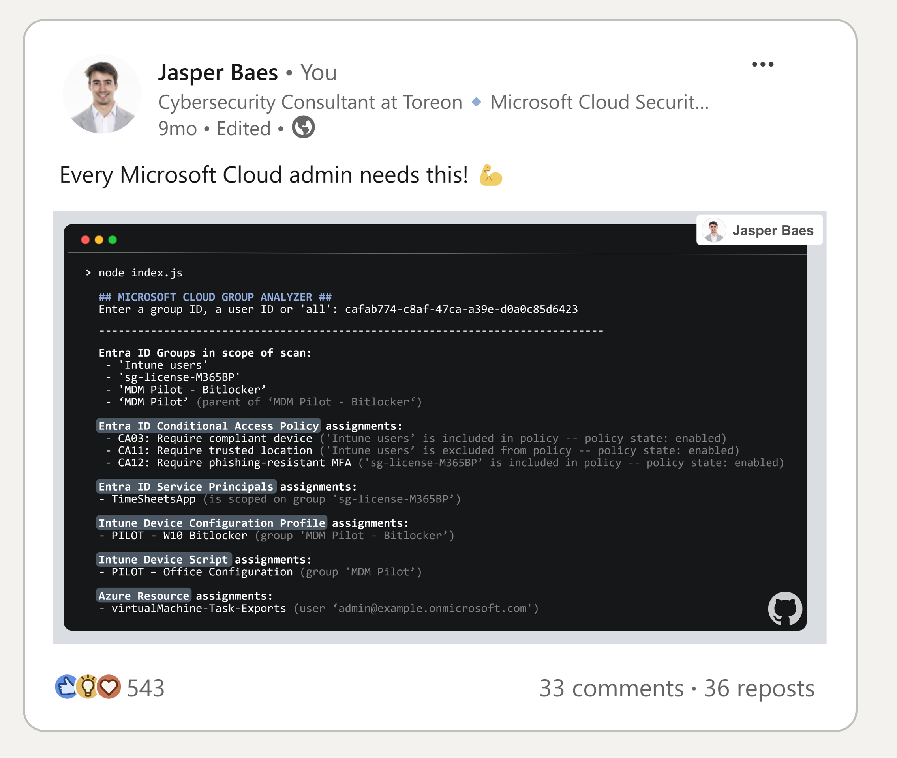
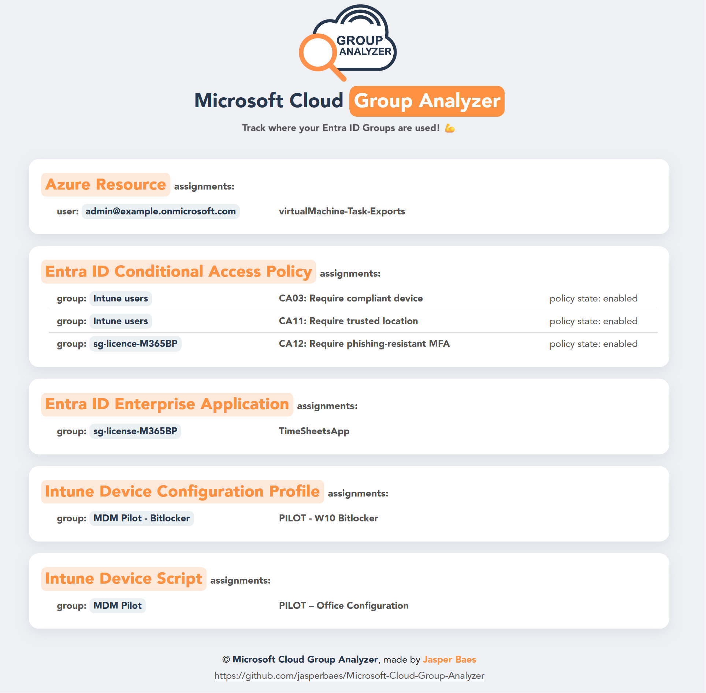

<br>
<p align="center">
  <a href="https://www.linkedin.com/in/jasper-baes/">
    
  </a>
  <h3 align="center">Microsoft Cloud Group Analyzer</h3>
  <p align="center">
    Track where your Entra ID Groups are used! 💪
    <br />
    <a href="https://github.com/jasperbaes/Microsoft-Cloud-Group-Analyzer#installation-and-usage">View setup guide </a>
    ·
    <a href="https://github.com/jasperbaes/Microsoft-Cloud-Group-Analyzer/fork"> Fork this project</a>
    ·
    <a href="https://github.com/jasperbaes/Microsoft-Cloud-Group-Analyzer/issues"> Report Bug </a>
    ·
    <a href="https://github.com/jasperbaes/Microsoft-Cloud-Group-Analyzer/issues"> Request Feature </a>
  </p>
</p>
<br />


Entra Groups are often used in multiple locations in your environment and used by multiple admins. Without continuously updating documentation or syncing with other admins, you’re all using groups blindly, potentially causing unintended security or user impact through changes in group memberships. Therefore, I've created this script.

For **Microsoft Cloud admins** who **struggle to keep track of where Entra groups are used**, Group Analyzer is an **opensource script** that provides **instant insights in what services/policies/... a given group or user is scoped to**.

<p align="center"><a href="./assets/mcga-shared.png" target="_blank"></a></p>
Generated webreport:
<p align="center"><a href="./assets/example-report.png" target="_blank"></a></p>

Group Analyzer is an essential script for Microsoft Cloud Administrators seeking comprehensive visibility into the usage of Entra groups across their environment. By providing detailed insights, this tool empowers admins to:

- **Prevent Unintended Impacts:** Safeguard against inadvertent membership modifications in groups that could trigger unexpected configuration changes in various services.
- **Enhance Group Management:** Maintain a clear overview of group assignments, ensuring efficient and informed management of your cloud environment.
- **Save time:** Don't spend time going over all of your policies and services looking where a certain Entra group is used.
- **Be in control:** To be certain and have confirmation that you are not adding users to groups, causing unforseen impact.

Find the original post on [LinkedIn](https://www.linkedin.com/feed/update/urn:li:activity:7157748584753319936/).

## What's in scope?

Group Analyzer lists group memberships for following services:

| Available |                     Service                      |                                                                     Description / Comment / Reason |
| --------- | :----------------------------------------------: | -------------------------------------------------------------------------------------------------: |
| ✅         |            Entra Group memberships            |                                                                                                    |
| ✅         |                  Entra ID Roles                  |                                                                                                    |
| ✅         |         Entra ID Enterprise Applications         |                                                                                                    |
| ✅         |            Entra ID MFA Registration             |                                                                                                    |
| ✅         |         Entra ID Authentication Methods          |                                                                                                    |
| ✅         |       Entra ID Conditional Access Policies       |                                                                                                    |
| ✅         |   Intune Enrollment Devices Limit restrictions   |                                                                                                    |
| ✅         |     Intune Enrollment Device OS restrictions     |                                                                                                    |
| ✅         |            Intune Compliance Policies            |                                                                                                    |
| ✅         |          Intune Configuration Profiles           |                                                                                                    |
| ✅         |              Intune Device Scripts               |                                                                                                    |
| ✅         |          Intune App Protection Policies          |                                                                                                    |
| ✅         |        Intune App Configuration Policies         |                                                                                                    |
| ✅         |       Intune Autopilot Deployment Profiles       |                                                                                                    |
| ✅         |               Microsoft 365 Teams                |                                                                                                    |
| ✅         |                 Azure Resources                  | If the input is a User ID, the resources where that specific user is assigned to are also reported |
| ✅         |               Azure Subscriptions                |                                                                                                    |
| ✅         |                  Access Package                  |                                                                                                    |
| ❌         | Entra ID Authentication Methods feature settings |                                                 Coming soon  |
| ❌         |           Entra ID Administrative Unit           |                                                                                        Coming soon |
| ❌         |              Entra ID Cross Tenant               |                                                                                        Coming soon |
| ❌         |            Entra ID App Registrations            |                              Coming soon |

<!-- to check: -->
<!-- https://graph.microsoft.com/v1.0/policies/adminConsentRequestPolicy -->

## Installation and usage

<a href="./assets/mcga-1.png" target="_blank"></a> <br>
<a href="./assets/mcga-2.png" target="_blank"></a> <br>
<a href="./assets/mcga-3.png" target="_blank"></a> <br>


```sh
git clone https://github.com/jasperbaes/Microsoft-Cloud-Group-Analyzer.git
cd ./Microsoft-Cloud-Group-Analyzer
npm install
```

Rename the .env.example file in the root of the folder to .env and fill in below fields (guide above):

```
CLIENTID=<app registration ID>
TENANTID=<your tenant ID>
CLIENTSECRET=<app secret>
```

## Usage

Examples:

```sh
node index.js <user ID>
node index.js <group ID>
node index.js all
```

Export examples:
```sh
node index.js xxxx-xxxx-xxxx-xxxx --export-json
node index.js xxxx-xxxx-xxxx-xxxx --export-csv
node index.js xxxx-xxxx-xxxx-xxxx --export-json --export-csv
```

Import example:
```sh
node index.js all -f Cloud-Analyzer-export.json
```

CLI-only, skip, limit and debug parameter:
```sh
node index.js xxxx-xxxx-xxxx-xxxx --export-json --cli-only
node index.js xxxx-xxxx-xxxx-xxxx --skip 10 --limit 5
node index.js xxxx-xxxx-xxxx-xxxx --debug
```

| Parameter           |               Description |
| ----------------- | --------------------------------------------------------------: |
| `xxxx-xxxx-xxxx-xxxx` | The group ID / user ID or 'all' should be the first parameter. This parameter is optional.  |
| `--export-json` | This parameter will export the results to JSON in a file in the current directory. This parameter is optional and can be used with any other parameter. |
| `--export-csv` | This parameter will export the results to JSON in a file in the current directory. This parameter is optional and can be used with any other parameter. |
| `-f` | This parameter specifies an import JSON file. Format needs to be the same as the JSON exported with the parameter --export-json. This parameter is optional and can be used with any other parameter. |
| `--cli-only` | With this parameter, the web report will not be generated or opened. This parameter is optional and can be used with any other parameter. |
| `-s` or `--skip` | Limits the number of groups in scope. |
| `-l` or `--limit` | Limits the number of groups in scope. |
| `-d` or `--debug` | Debug output and log file. |

Without specifying an ID in the command, the script will ask you to paste a group ID, a user ID or the word 'all':

| Option            |               example                |                                                     Description |
| ----------------- | :----------------------------------: | --------------------------------------------------------------: |
| Entra Group ID | `99ccbd7e-0fc9-4545-8cf9-ee89191ed78d` |                       The given group ID + subgroups will be in scope |
| Entra User ID  | `caf7b774-c8ab-47c3-a39e-d0a0d85d6423` | All groups where the given user is member of are in scope + subgroups |
| 'all'             |                 `all`                  |              This option will take all Entra groups in scope |

## Web report

Automatically, a visual web report will be generated and opened in your default browser. To save the report as a PDF file, use the shortcut Ctrl + P. To skip the web report and use the command line interface only, include the `--cli-only` parameter.

## Issues

We strive to maintain the functionality and reliability of this project. However, some issues may arise, particularly due to changes in external dependencies such as the Microsoft 365 or Azure APIs. These changes can sometimes introduce unexpected behavior or breaking changes in our application.

### How to Report Issues
If you encounter any problems, please help us by reporting them in the following manner:

1. **Search Existing Issues:** Before submitting a new issue, please check if it has already been reported or addressed. You can find existing issues in the [Issues section](https://github.com/jasperbaes/Microsoft-Cloud-Group-Analyzer/issues) of our GitHub repository.

2. **Create a New Issue:** If the issue hasn't been reported, you can [create a new issue](https://github.com/jasperbaes/Microsoft-Cloud-Group-Analyzer/issues/new) by providing the following details:
   - A descriptive title of the issue.
   - A detailed description of the problem.
   - Steps to reproduce the issue, including any relevant code snippets.
   - The environment details: operating system, browser, and version used.
   - Any error messages or logs that were observed.

We are committed to addressing reported issues as efficiently as possible. Your feedback and contributions are invaluable in helping us maintain and improve this project. Thank you for your support and collaboration!

## Contact

Jasper Baes (https://jbaes.be and https://www.linkedin.com/in/jasper-baes)

## Release history

Release version numbers: YEAR-WEEK

- 2024.50
  - 8x faster (local caching + processing in batches of 10)
- 2024.48
  - add skip, limit and debug parameter ([#12](https://github.com/jasperbaes/Microsoft-Cloud-Group-Analyzer/issues/12))
  - report improvements
- 2024.45
  - bug fixes, improved error handline, documentation updates
- 2024.07
  - bugfix ([#8](https://github.com/jasperbaes/Microsoft-Cloud-Group-Analyzer/issues/8))
- 2024.06
  - visual webreport
  - open JSON export as input file
- 2024.05
  - temporary removed documentation for user login. App authentication recommended for now.
  - improved error reporting
  - improved documentation and setup guide
  - export to JSON and CSV
  - added new service: Access Packages
  - added version checker
- 2024.04
  - initial release

## License

Please be aware that the Group Analyzer code is intended solely for individual administrators' personal use. It is not licensed for use by organizations seeking financial gain. This restriction is in place to ensure the responsible and fair use of the tool. Admins are encouraged to leverage this code to enhance their own understanding and management within their respective environments, but any commercial or organizational profit-driven usage is strictly prohibited.

Thank you for respecting these usage terms and contributing to a fair and ethical software community. 

Jasper Baes (https://jbaes.be and https://www.linkedin.com/in/jasper-baes)
