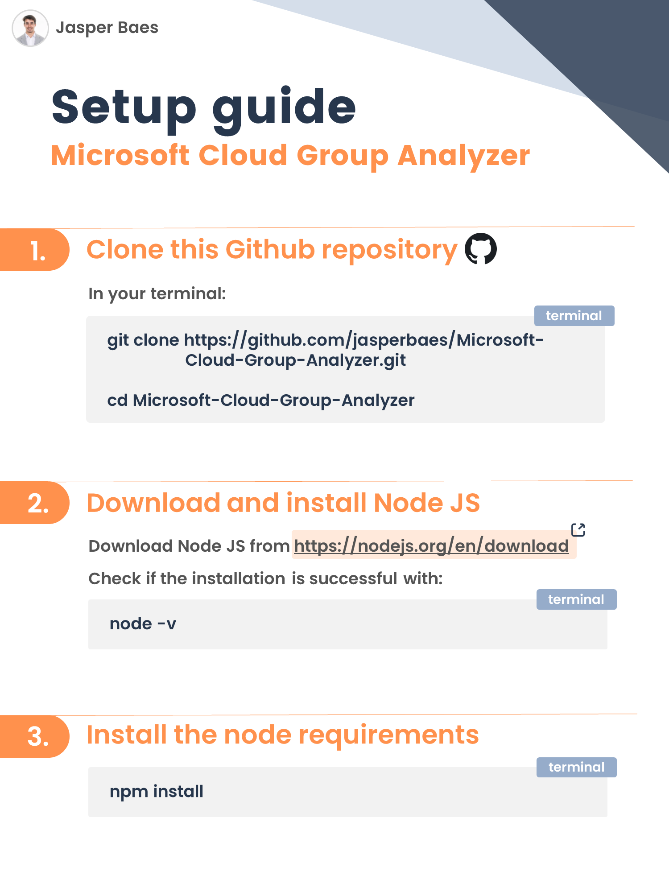
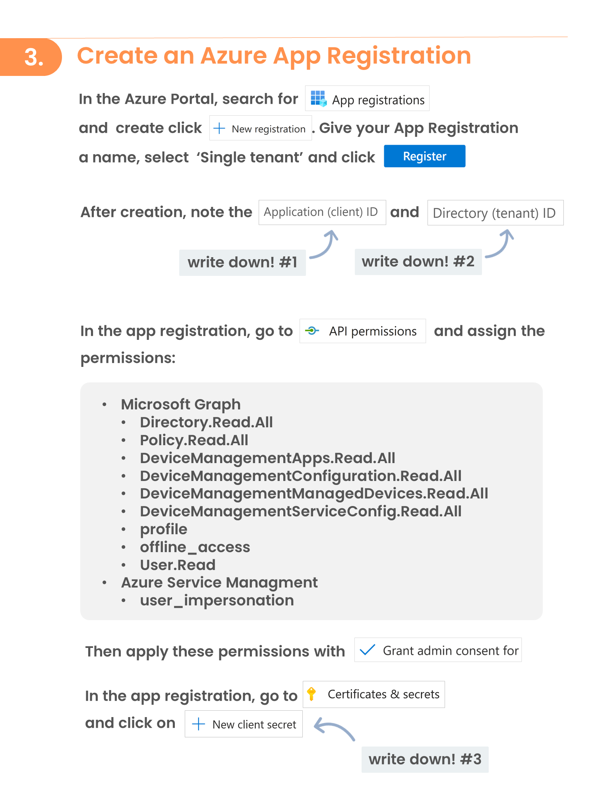

# Microsoft Cloud Group Analyzer

Entra ID Groups are often used in multiple locations in your environment and used by multiple admins. Without continuously updating documentation or syncing with other admins, you’re all using groups blindly, potentially causing unintended security or user impact through changes in group memberships. Therefore, I've created this script.

For **Microsoft Cloud admins** who **struggle to keep track of where Entra ID groups are used**, Group Analyzer is an **opensource script** that provides **instant insights in what services/policies/... a given group or user is scoped to**.

<a href="./readme/mcga.png" target="_blank"></a>

Group Analyzer is an essential script for Microsoft Cloud Administrators seeking comprehensive visibility into the usage of Entra ID groups across their environment. By providing detailed insights, this tool empowers admins to:

- **Prevent Unintended Impacts:** Safeguard against inadvertent membership modifications in groups that could trigger unexpected configuration changes in various services.
- **Enhance Group Management:** Maintain a clear overview of group assignments, ensuring efficient and informed management of your cloud environment.
- **Save time:** Don't spend time going over all of your policies and services looking where a certain Entra ID group is used.
- **Feel in control:** To be certain and have confirmation that you are not adding users to groups, causing unforseen impact.

## What's in scope?

Group Analyzer lists group memberships for following services:

| Available |                     Service                      |                                                                     Description / Comment / Reason |
| --------- | :----------------------------------------------: | -------------------------------------------------------------------------------------------------: |
| ✅         |            Entra ID Group memberships            |                                                                                                    |
| ✅         |                  Entra ID Roles                  |                                                                                                    |
| ✅         |         Entra ID Enterprise Applications         |                                                                                                    |
| ✅         |            Entra ID MFA Registration             |                                                                                                    |
| ✅         |         Entra ID Authentication Methods          |                                                                                                    |
| ✅         |       Entra ID Conditional Access Policies       |                                                                                                    |
| ✅         |   Intune Enrollment Devices Limit restrictions   |                                                                                                    |
| ✅         |     Intune Enrollment Device OS restrictions     |                                                                                                    |
| ✅         |            Intune Compliance Policies            |                                                                                                    |
| ✅         |          Intune Configuration Profiles           |                                                                                                    |
| ✅         |              Intune Device Scripts               |                                                                                                    |
| ✅         |          Intune App Protection Policies          |                                                                                                    |
| ✅         |        Intune App Configuration Policies         |                                                                                                    |
| ✅         |       Intune Autopilot Deployment Profiles       |                                                                                                    |
| ✅         |               Microsoft 365 Teams                |                                                                                                    |
| ✅         |                 Azure Resources                  | If the input is a User ID, the resources where that specific user is assigned to are also reported |
| ✅         |               Azure Subscriptions                |                                                                                                    |
| ❌         | Entra ID Authentication Methods feature settings |                                                 Coming soon (Only for Microsoft Authenticator app) |
| ❌         |           Entra ID Administrative Unit           |                                                                                        Coming soon |
| ❌         |              Entra ID Cross Tenant               |                                                                                        Coming soon |
| ❌         |                 Attack Simulator                 |                                                   Microsot Graph does not provide the target scope |
| ❌         |            Entra ID App Registrations            |                              Entra ID App Registrations can only be scoped on users, not on groups |


## Installation and usage

<a href="./readme/mcga-1.png" target="_blank"></a> <br>
<a href="./readme/mcga-2.png" target="_blank"></a> <br>
<a href="./readme/mcga-3.png" target="_blank"></a> <br>


```sh
git clone https://github.com/jasperbaes/Microsoft-Cloud-Group-Analyzer.git
cd ./Microsoft-Cloud-Group-Analyzer
npm install
```

## Usage

There are 2 ways to authenticate:
- with an admin account (run 'az login' in your terminal. You might not have all required permissions assigned!)
- with an Azure App registration (create an Azure App Registration with all .Read.All permissions and fill credentials in the .env file)

```
CLIENTSECRET=<app secret>
TENANTID=<your tenant ID>
CLIENTID=<app registration ID>
```

To run the script:

```sh
az login    <-- only if you use admin account authentication
node index.js
```

Now paste a group ID, a user ID or the word 'all'.

 | Option            |               example                |                                                     Description |
 | ----------------- | :----------------------------------: | --------------------------------------------------------------: |
 | Entra ID Group ID | 99ccbd7e-0fc9-4545-8cf9-ee89191ed78d |                       The given group will be taken in scope ID |
 | Entra ID User ID  | caf7b774-c8ab-47c3-a39e-d0a0d85d6423 | All groups where the given user is member of are taken in scope |
 | 'all'             |                 all                  |              This option will take all Entra ID groups in scope |

## Roadmap
- [x] Caching (local)
- [ ] Authentication methods
  - [x] User authentication
  - [ ] Azure App Registration certificate authentication
  - [ ] Managed Identity
- [ ] Webinterface
- [ ] Export
  - [ ] CSV
  - [ ] JSON
- [ ] Ennumerate the actual setting, not assignment only
- [ ] Cronjob / call from existing service

## Issues?

I cannot rule out the existence of current or future issues with this open-source project. These may be related to hard-coded elements or the Microsoft 365 API used. If there are any issues, please feel free to report them. I will see what I can do to resolve them.

## License

Please be aware that the Group Analyzer code is intended solely for individual administrators' personal use. It is not licensed for use by organizations seeking financial gain. This restriction is in place to ensure the responsible and fair use of the tool. Admins are encouraged to leverage this code to enhance their own understanding and management within their respective environments, but any commercial or organizational profit-driven usage is strictly prohibited.

Thank you for respecting these usage terms and contributing to a fair and ethical software community. 

## Contact

Jasper Baes (https://www.linkedin.com/in/jasper-baes)